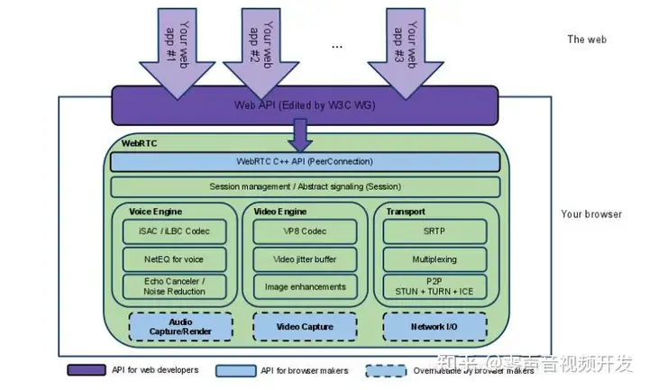
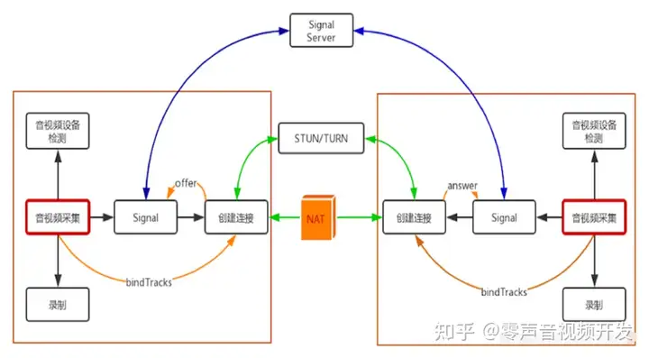
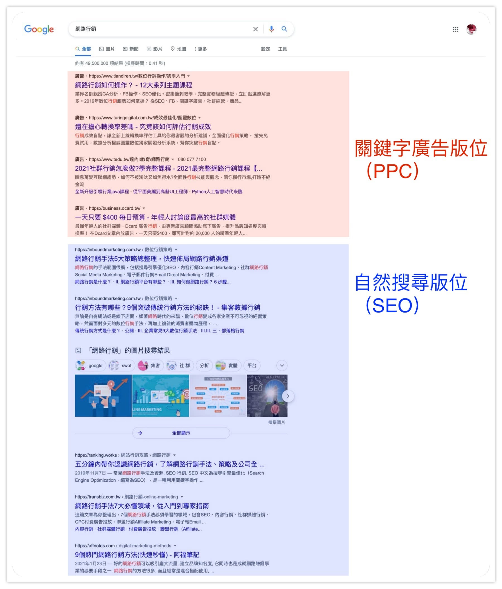
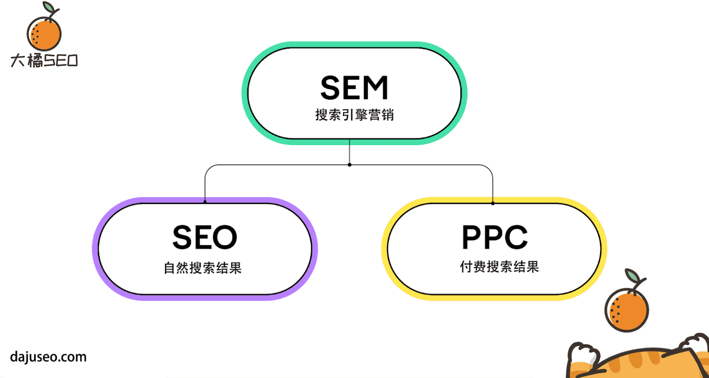

>#### 以下有使用了preplexity ai来学习和找资料

### 什么是WebRTC?
- Web Real-Time Communications ,简称为(Web RTC):定义浏览器API
- Real-Time Communication in Web-browsers,简称(RTCWEB)IETF标准组织：定义其所需的协议，数据，安全性等手段。

### WebRTC的核心组成
WebRTC由三个主要API构成，每个API承担不同的功能：
- getUserMedia：用于获取本地音频和视频流，允许应用访问用户的摄像头和麦克风。
- RTCPeerConnection：负责建立和维护点对点连接，传输音视频数据。它处理网络信息交换、媒体协商等。
- RTCDataChannel：用于在对等端之间传输任意数据，支持二进制数据传输。

### WebRTC架构
- Your Web App：开发者使用WebRTC API构建的应用程序。
- Web API：提供给开发者的JavaScript接口，主要包括三个核心功能：
1. MediaStream：用于捕获和处理音视频流。
2. RTCPeerConnection：管理点对点连接的核心接口。
3. RTCDataChannel：用于数据传输的通道接口
4. WebRTC Native C++ API：为浏览器厂商提供的本地API，便于实现WebRTC标准。
5. Transport/Session Layer：负责会话管理和数据传输，包括STUN、TURN和ICE协议，用于网络穿越和连接管理

[WebRTC基础知识](https://github.com/0voice/cpp_backend_awsome_blog/blob/main/%E3%80%90NO.466%E3%80%91%E3%80%90%E7%BD%91%E7%BB%9C%E9%80%9A%E4%BF%A1%20--%20WebRTC%E3%80%91WebRTC%20%E5%9F%BA%E7%A1%80%E7%9F%A5%E8%AF%86%20--%20%E5%9F%BA%E7%A1%80%E7%9F%A5%E8%AF%86%E6%80%BB%E7%BB%93%E3%80%901%E3%80%91WebRTC%20%E7%AE%80%E4%BB%8B.md)

---
### WebRTC的功能
WebRTC支持多种功能，使其在实时通信中非常强大：
- 音频处理：
支持多种音频编解码器，如Opus、G711等。
包含回声消除（AEC）和噪声抑制（NR）功能，以提高通话质量。
- 视频处理：
支持VP8、VP9和H.264等视频编解码器。
提供图像增强功能，包括降噪和颜色调整。
- 数据传输：
支持P2P传输，利用SRTP协议确保数据安全。
使用多路复用技术减少网络资源消耗
---
### WebRTC 的主要组件有哪些
>主要组件包括以下三个核心API，每个组件在实现实时通信中扮演着重要角色：
#### 1. MediaStream
- MediaStream API允许开发者使用JavaScript访问用户的音频和视频设备。它负责捕获和处理多媒体流数据，提供对用户设备（如摄像头和麦克风）的控制，并允许开发者获取关于可用媒体设备的信息。

#### 2. RTCPeerConnection
- RTCPeerConnection是WebRTC的核心组件，负责建立和管理点对点连接。它处理网络连接的建立，包括NAT穿越、媒体编解码、数据传输和带宽管理等。通过这个API，开发者可以将MediaStream中的音视频流发送到对方，并接收来自对方的流。
#### 3. RTCDataChannel
- RTCDataChannel API允许在WebRTC客户端之间进行双向数据传输，支持任意类型的数据（不仅限于音视频）。它基于UDP协议，提供了可靠的数据传输方式，适用于实时游戏、文件共享等应用场景

- [WebRTC技术原理详解](https://www.nxrte.com/jishu/webrtc/41494.html)
- [开源框架WebRTC指南：3大API详解](https://juejin.cn/post/6956502942467751966)
---
### 附加组件
1. **信令（Signaling）**
- 虽然信令不直接包含在 WebRTC 的技术规范中，但它在建立连接时至关重要。信令用于协调客户端之间的通信，包括会话控制和网络信息的交换。

2. **STUN/TURN 服务器**
- STUN（Session Traversal Utilities for NAT）和 TURN（Traversal Using Relays around NAT）服务器帮助设备在 NAT 环境中建立有效的网络连接，确保媒体流能够顺利传输。
---
###  WebRTC 相关的一些重要数学公式和概念
1. **Mathis Equation**
>用于计算网络带宽（BW），特别是在存在数据包丢失的情况下。公式为：

$
\text{Bandwidth (BW)} = \frac{\text{MSS}}{\text{RTT}} \times \frac{1}{\sqrt{p}}$

- MSS 是最大报文段大小（Maximum Segment Size）。
- RTT 是往返时间（Round Trip Time）。
- p 是数据包丢失率（packet loss rate）。

\*\*评估在 WebRTC 中的数据传输性能，尤其是在不同网络条件下的表现\*\*

---
2. **Mean Opinion Score (MOS)**
>常用来评估音频通话质量的算法，其计算公式如下：
$$
R = 93.2 - \left( \frac{10}{{\text{EffectiveLatency} - 120}} \right) \quad \text{如果 EffectiveLatency} \geq 160
$$

### 解释：
- **R**：质量评分（可能是网络或音频质量评分）。
- **EffectiveLatency**：有效延迟（单位：毫秒）。

当 **EffectiveLatency ≥ 160** 时，根据公式计算质量评分。

>MOS 的最终值通过以下公式计算：

$MOS = 1 + (0.035 \cdot R) + (0.000007 \cdot R \cdot (R - 60) \cdot (100 - R))$

[stackoverflow-WebRTC公式](https://stackoverflow.com/questions/54124329/is-there-a-formula-for-rating-webrtc-audio-quality-as-excellent-good-fair-or)

[透過概念介紹與實作簡易視訊功能，理解 WebRTC](https://hackmd.io/@LiangC/H1oGUDw76)

### WebRTC 一对一对话
>一对一通讯结构图

- 两个 WebRTC 终端，负责音视频采集、编解码、NAT 穿越、音视频数据传输；
- 一个 Signal（信令）服务器，负责信令处理，如加入房间、离开房间、媒体协商消息的传递等；
- 一个 STUN/TURN 服务器，负责获取 WebRTC 终端在公网的 IP 地址，以及 NAT 穿越失败后的数据中转；

>一对一流程图

资料以及图片取自[github - cpp_backend_awsome_blog
](https://github.com/0voice/cpp_backend_awsome_blog/blob/main/%E3%80%90NO.466%E3%80%91%E3%80%90%E7%BD%91%E7%BB%9C%E9%80%9A%E4%BF%A1%20--%20WebRTC%E3%80%91WebRTC%20%E5%9F%BA%E7%A1%80%E7%9F%A5%E8%AF%86%20--%20%E5%9F%BA%E7%A1%80%E7%9F%A5%E8%AF%86%E6%80%BB%E7%BB%93%E3%80%901%E3%80%91WebRTC%20%E7%AE%80%E4%BB%8B.md)

### 应用场景
WebRTC技术广泛应用于多个领域，包括但不限于：
- 视频聊天：如Skype、WhatsApp等应用，实现实时视频通话。
- 在线教育：教师与学生之间进行实时互动，提高学习体验。
- 远程医疗：医生可以通过视频与患者进行远程诊疗。

---
># 额外知识
- 接下来会依照5个W和1个H来讲解SEO,会以理解后的形式去解释

分别是What、When、Who、Why、Where、How:

## What:
#### 什么是SEO?
- SEO是(Search Engine Optimization)的简写，称为搜索引擎优化。透過「搜尋引擎的自然搜尋管道」來为網站訪客提供更好的品質與數量的一種手法。

>#### 什么是SEM?
- SEM是(Search Engine Marketing)的简写，称为搜索引擎营销。通过付费广告将提升网站在搜索引擎的点击。

>#### 什么是PPC?
- PPC是(Pay-Per-Click)的简写，称为按点击付费。通过一种数字广告模式，广告主会在用户点击广告时要求支付费用。

>#### SEO和SEM的不同之处？
SEM是由SEO和PPC组合而成，SEM是更广泛的概念。也包括SEO和PPC。通过这两种方式方式进行结合来提高网站在搜索引擎中的可见性和流量。

>如下图：

[SEO资料来源](https://relab.cc/blog/seo%E8%81%96%E7%B6%93/)

>SEM=SEO+PPC的架构图如下：

[架构图资料来源-大橘SEO](https://dajuseo.com/premium-seo-strategies/seo-vs-sem/)

>接下来说明SEO、SEM和PPC的优点和缺点，用到了preplexity ai：

SEM（搜索引擎营销）:

优点：
- 快速见效：通过付费广告，企业可以迅速提升网站在搜索引擎中的可见性，立即吸引流量。
- 精准定位：可以根据用户的搜索行为和偏好进行精准投放，提升转化率。
- 灵活性高：广告主可以随时调整广告预算和关键词设置，以适应市场变化。

缺点：
- 成本高：随着竞争加剧，关键词竞价可能导致广告费用显著上升。
- 竞争激烈：越来越多的企业参与SEM，导致关键词竞争加剧，难以获得理想的曝光率。
- 效果依赖于预算：一旦预算耗尽，广告排名会迅速下降，流量随之减少。

SEO（搜索引擎优化）：

优点：
- 长期效果：一旦网站排名提升，能够持续获得自然流量，无需额外支付费用。
- 成本相对较低：虽然初期投入时间和精力较多，但长期来看，相比于SEM，SEO的维护成本较低。
- 用户信任度高：自然排名结果通常被用户视为更可信，有助于提高品牌形象。

缺点：
- 见效慢：SEO需要时间进行优化，通常需要几个月到一年的时间才能看到明显效果。
- 不确定性高：搜索引擎算法频繁变化，可能影响网站排名的稳定性。
- 技术门槛高：需要专业知识和技能来进行有效优化，对于非专业人员来说可能较为困难。

PPC（按点击付费）：

优点：
- 即时流量：通过设置关键词和竞价，可以迅速获得流量和曝光23。
- 灵活控制预算：广告主可以根据实际情况灵活调整预算和出价策略，以控制广告支出24。
- 可测量性强：PPC活动效果易于跟踪和分析，可以实时调整策略以提高投资回报率3.

缺点：
- 成本高昂：热门关键词的点击费用可能非常高，长期投入可能导致资金压力13.
- 恶意点击风险：存在竞争对手或其他因素导致的恶意点击，从而浪费广告费用23.
- 依赖性强：一旦停止投放广告，流量会立即下降，没有持续性3.

## WHO:
（以下来源取自[SEO资料来源](https://relab.cc/blog/seo%E8%81%96%E7%B6%93/)
>需要执行SEO的是谁？
1. 社会、品牌经营
2. 新闻媒体
3. 内容平台经营
4. 网络管理人员

## WHEN:
>需要多久才能看到SEO的成效？

[SEO](https://juejin.cn/post/7247901054237917221)
- 以下取自preplexity AI的资料来理解：

**预期时间范围**
1. 初步变化：在开始SEO优化后的第一个月，可能会看到一些小的变化，但通常不明显1。
2. 明显效果：一般来说，通常需要4到6个月才能看到更显著的效果2。对于新网站，这一过程可能更长，因为需要时间建立信任和权威度。
3. 长期效果：对于一些关键字的稳定排名，可能需要12到16个月的时间3。

**影响因素**
1. 竞争对手：如果目标关键词竞争激烈，可能需要更长时间才能取得排名。
2. 网站历史：新网站通常需要更多时间来建立权威性，而已有历史的网站则可能更快见效。
3. 内容更新频率：定期发布高质量内容有助于提高搜索引擎的索引速度和排名。
4. 技术优化：良好的网站结构和技术优化可以提高搜索引擎的索引效率。

## WHERE:

>SEO的执行环境：
- 拥有属于自己的网域(Domain),并且百分之百能掌控这项网域。

>网站平台包括：
1. 个人博客
2. 电子商务网站
3. 企业官网
4. 新闻媒体网站
5. 内容平台

>技术包含：
1. 内容管理系统（CMS）：使用支持SEO功能的CMS（如WordPress），可以方便地编辑和发布内容。
2. 编辑工具：需要具备编辑文本、图片和HTML代码的能力，以便进行页面优化。
3. 网站性能：良好的主机响应速度和网站加载速度对SEO至关重要，影响用户体验和搜索引擎排名34。

## HOW:

>执行SEO的核心要点：
1. 優質內容的建立 (Quality Content)
2. 關鍵字的配合 (Keywords)
3. 建立反向連結 (Link Building)
4. 技術層面優化 (Technical Optimization)

